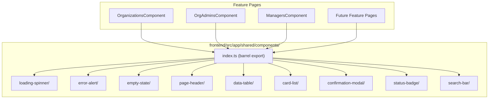
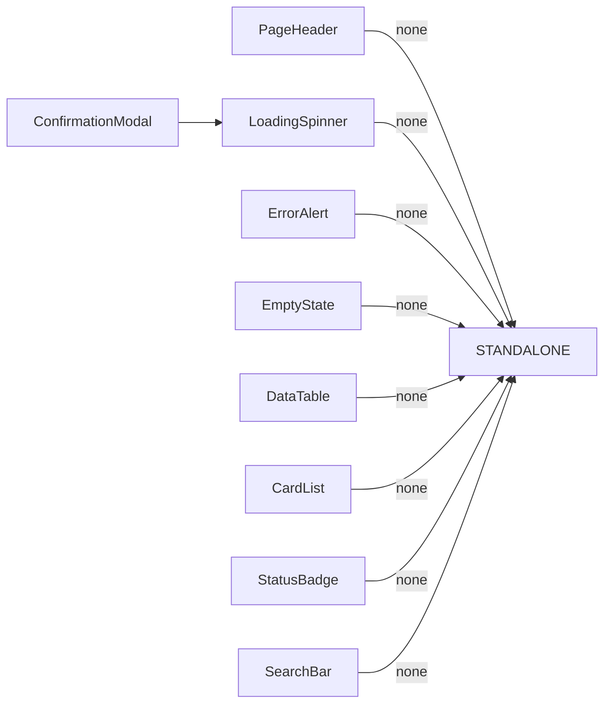

# Design Document: Reusable Components Library

## Overview

This design extracts duplicated UI patterns from the existing feature pages (organizations, org-admins, managers) into a shared component library at `frontend/src/app/shared/components/`. Each component is a standalone Angular 21 component using signal-based inputs/outputs, `ChangeDetectionStrategy.OnPush`, and Bootstrap 5.3 utility classes. The library provides nine components — Loading Spinner, Error Alert, Empty State, Page Header, Data Table, Card List, Confirmation Modal, Status Badge, and Search Bar — plus a barrel export and an AI steering file.

The existing pages duplicate identical markup for loading spinners (centered `spinner-border text-secondary` with visually-hidden label), error alerts (danger alert with optional retry button), empty states (centered muted text), page headers (flex row with title and action button), responsive table/card pairs (`d-none d-lg-block` table + `d-lg-none` card list), confirmation modals (backdrop + centered dialog with cancel/confirm), and status badges (Bootstrap badge with status-to-color mapping). Extracting these into shared components eliminates ~60% of the template markup per feature page and ensures visual consistency across all four role areas.

### Key Design Decisions

1. **Signal inputs over `@Input()` decorators**: Angular 21 signal inputs (`input()`, `input.required()`) align with the project's signal-first approach and enable fine-grained change detection with OnPush.

2. **Content projection for flexibility**: The Data Table uses `ng-template` references for cell rendering, the Card List uses a template for card content, and the Confirmation Modal uses `<ng-content>` for body content. This keeps components reusable without over-constraining their API.

3. **No NgModules**: All components are standalone with their dependencies declared in the `imports` array, matching the project convention.

4. **Bootstrap classes only**: No custom CSS framework or component library. All styling uses Bootstrap 5.3 utility classes loaded globally via `angular.json`.

5. **Template-driven column definitions for Data Table**: Rather than a complex configuration object, columns are defined using directive-based `<ng-template>` references with a lightweight column definition interface. This keeps the API declarative and Angular-idiomatic.

## Architecture



### Component Dependency Graph



The Confirmation Modal imports the Loading Spinner to show a spinner on the confirm button during saving state. All other components are fully independent.

## Components and Interfaces

### 1. LoadingSpinnerComponent

**Selector:** `app-loading-spinner`
**File path:** `shared/components/loading-spinner/`

```typescript
// Inputs
label = input<string>('Loading...');

// Template structure
// <div class="text-center py-5" data-testid="loading-spinner">
//   <div class="spinner-border text-secondary" role="status">
//     <span class="visually-hidden">{{ label() }}</span>
//   </div>
// </div>
```

### 2. ErrorAlertComponent

**Selector:** `app-error-alert`
**File path:** `shared/components/error-alert/`

```typescript
// Inputs
message = input.required<string>();

// Outputs
retry = output<void>();

// The retry output is checked in the template: if retry has observers,
// render the retry button. Otherwise, render the alert without a button.
// We track whether a retry handler is bound via an `retryable` input.
retryable = input<boolean>(false);

// Template structure
// <div class="alert alert-danger d-flex flex-column flex-sm-row align-items-sm-center gap-2"
//      role="alert" data-testid="error-alert">
//   <span class="flex-grow-1">{{ message() }}</span>
//   @if (retryable()) {
//     <button class="btn btn-sm btn-outline-danger" (click)="retry.emit()">Retry</button>
//   }
// </div>
```

### 3. EmptyStateComponent

**Selector:** `app-empty-state`
**File path:** `shared/components/empty-state/`

```typescript
// Inputs
title = input.required<string>();
description = input.required<string>();

// Template structure
// <div class="text-center py-5 text-muted" data-testid="empty-state">
//   <p class="fs-5 mb-1">{{ title() }}</p>
//   <p>{{ description() }}</p>
// </div>
```

### 4. PageHeaderComponent

**Selector:** `app-page-header`
**File path:** `shared/components/page-header/`

```typescript
// Inputs
title = input.required<string>();
actionLabel = input<string>();

// Outputs
action = output<void>();

// Template structure
// <div class="d-flex flex-column flex-sm-row justify-content-sm-between
//             align-items-sm-center gap-2 mb-4">
//   <div>
//     <ng-content select="[slot=before-title]"></ng-content>
//     <h2 class="mb-0">{{ title() }}</h2>
//   </div>
//   @if (actionLabel()) {
//     <button class="btn btn-dark w-100 w-sm-auto" (click)="action.emit()">
//       {{ actionLabel() }}
//     </button>
//   }
// </div>
```

The `[slot=before-title]` content projection slot allows inserting back-navigation links (as seen in the org-admins page).

### 5. DataTableComponent

**Selector:** `app-data-table`
**File path:** `shared/components/data-table/`

```typescript
// Inputs
columns = input.required<ColumnDef[]>();
data = input.required<T[]>();  // generic via template
trackBy = input.required<(index: number, item: T) => unknown>();

// ColumnDef interface
interface ColumnDef {
  header: string;
  cssClass?: string;       // e.g., 'd-none d-xl-table-cell' for visibility
  headerCssClass?: string; // additional header classes like 'text-end'
}

// Template structure
// <div class="d-none d-lg-block">
//   <div class="table-responsive">
//     <table class="table table-hover align-middle">
//       <thead class="table-light">
//         <tr>
//           @for (col of columns(); track col.header) {
//             <th [class]="col.cssClass">{{ col.header }}</th>
//           }
//         </tr>
//       </thead>
//       <tbody>
//         <ng-content></ng-content>
//       </tbody>
//     </table>
//   </div>
// </div>
```

The Data Table renders the header row from column definitions and projects table body rows via `<ng-content>`. This approach keeps cell rendering in the parent template where the data type is known, avoiding complex generic template passing. The parent iterates its data with `@for` and renders `<tr>` elements directly inside `<app-data-table>`.

### 6. CardListComponent

**Selector:** `app-card-list`
**File path:** `shared/components/card-list/`

```typescript
// Inputs
data = input.required<T[]>();
trackBy = input.required<(index: number, item: T) => unknown>();
cardTemplate = input.required<TemplateRef<{ $implicit: T }>>();

// Template structure
// <div class="d-lg-none">
//   @for (item of data(); track trackBy()(idx, item)) {
//     <div class="card mb-3 shadow-sm">
//       <div class="card-body">
//         <ng-container *ngTemplateOutlet="cardTemplate(); context: { $implicit: item }">
//         </ng-container>
//       </div>
//     </div>
//   }
// </div>
```

### 7. ConfirmationModalComponent

**Selector:** `app-confirmation-modal`
**File path:** `shared/components/confirmation-modal/`

```typescript
// Inputs
open = input.required<boolean>();
title = input.required<string>();
confirmLabel = input<string>('Confirm');
confirmStyle = input<string>('btn-danger');
saving = input<boolean>(false);

// Outputs
confirm = output<void>();
cancel = output<void>();

// Template structure
// @if (open()) {
//   <div class="modal-backdrop fade show"></div>
//   <div class="modal d-block fade show" tabindex="-1"
//        data-testid="confirmation-modal" (click)="cancel.emit()">
//     <div class="modal-dialog modal-dialog-centered modal-fullscreen-sm-down"
//          (click)="$event.stopPropagation()">
//       <div class="modal-content">
//         <div class="modal-header">
//           <h5 class="modal-title">{{ title() }}</h5>
//           <button type="button" class="btn-close" (click)="cancel.emit()"></button>
//         </div>
//         <div class="modal-body">
//           <ng-content></ng-content>
//         </div>
//         <div class="modal-footer flex-column flex-sm-row">
//           <button class="btn btn-outline-secondary w-100 w-sm-auto"
//                   (click)="cancel.emit()">Cancel</button>
//           <button class="btn w-100 w-sm-auto" [class]="confirmStyle()"
//                   [disabled]="saving()" (click)="confirm.emit()">
//             @if (saving()) {
//               <span class="spinner-border spinner-border-sm me-1" role="status"></span>
//             }
//             {{ confirmLabel() }}
//           </button>
//         </div>
//       </div>
//     </div>
//   </div>
// }
```

Focus trapping: When the modal opens, focus moves to the modal container. A `keydown` listener on the modal traps Tab/Shift+Tab within focusable elements. When the modal closes, focus returns to the previously focused element (captured on open).

### 8. StatusBadgeComponent

**Selector:** `app-status-badge`
**File path:** `shared/components/status-badge/`

```typescript
// Inputs
status = input.required<string>();
label = input.required<string>();
colorMap = input.required<Record<string, string>>();

// Computed
badgeClass = computed(() => this.colorMap()[this.status()] ?? 'bg-secondary');

// Template structure
// <span class="badge" [class]="badgeClass()" data-testid="status-badge">
//   {{ label() }}
// </span>
```

### 9. SearchBarComponent

**Selector:** `app-search-bar`
**File path:** `shared/components/search-bar/`

```typescript
// Inputs
placeholder = input<string>('Search...');
ariaLabel = input<string>('Search');

// Outputs
searchChange = output<string>();

// Internal state
searchValue = signal('');

// Debounce: uses rxjs Subject with debounceTime(300) piped in constructor,
// emitting through searchChange output.

// Template structure
// <div class="input-group" data-testid="search-bar-container">
//   <input type="text" class="form-control"
//          [placeholder]="placeholder()"
//          [attr.aria-label]="ariaLabel()"
//          data-testid="search-bar"
//          [value]="searchValue()"
//          (input)="onInput($event)" />
//   @if (searchValue()) {
//     <button class="btn btn-outline-secondary" type="button"
//             (click)="clear()" aria-label="Clear search">×</button>
//   }
// </div>
```

## Data Models

### ColumnDef Interface

```typescript
// frontend/src/app/shared/components/data-table/column-def.model.ts
export interface ColumnDef {
  /** Column header text */
  header: string;
  /** CSS class applied to both <th> and <td> cells (e.g., 'd-none d-xl-table-cell') */
  cssClass?: string;
  /** Additional CSS class for the <th> element only (e.g., 'text-end') */
  headerCssClass?: string;
}
```

### Component Input/Output Summary

| Component | Required Inputs | Optional Inputs | Outputs |
|---|---|---|---|
| LoadingSpinner | — | `label: string` | — |
| ErrorAlert | `message: string` | `retryable: boolean` | `retry: void` |
| EmptyState | `title: string`, `description: string` | — | — |
| PageHeader | `title: string` | `actionLabel: string` | `action: void` |
| DataTable | `columns: ColumnDef[]`, `data: T[]`, `trackBy: fn` | — | — |
| CardList | `data: T[]`, `trackBy: fn`, `cardTemplate: TemplateRef` | — | — |
| ConfirmationModal | `open: boolean`, `title: string` | `confirmLabel: string`, `confirmStyle: string`, `saving: boolean` | `confirm: void`, `cancel: void` |
| StatusBadge | `status: string`, `label: string`, `colorMap: Record<string, string>` | — | — |
| SearchBar | — | `placeholder: string`, `ariaLabel: string` | `searchChange: string` |

### Barrel Export

```typescript
// frontend/src/app/shared/components/index.ts
export { LoadingSpinnerComponent } from './loading-spinner/loading-spinner';
export { ErrorAlertComponent } from './error-alert/error-alert';
export { EmptyStateComponent } from './empty-state/empty-state';
export { PageHeaderComponent } from './page-header/page-header';
export { DataTableComponent } from './data-table/data-table';
export { ColumnDef } from './data-table/column-def.model';
export { CardListComponent } from './card-list/card-list';
export { ConfirmationModalComponent } from './confirmation-modal/confirmation-modal';
export { StatusBadgeComponent } from './status-badge/status-badge';
export { SearchBarComponent } from './search-bar/search-bar';
```

### File Structure

```
frontend/src/app/shared/components/
├── index.ts
├── loading-spinner/
│   ├── loading-spinner.ts
│   ├── loading-spinner.html
│   ├── loading-spinner.css
│   └── loading-spinner.spec.ts
├── error-alert/
│   ├── error-alert.ts
│   ├── error-alert.html
│   ├── error-alert.css
│   └── error-alert.spec.ts
├── empty-state/
│   ├── empty-state.ts
│   ├── empty-state.html
│   ├── empty-state.css
│   └── empty-state.spec.ts
├── page-header/
│   ├── page-header.ts
│   ├── page-header.html
│   ├── page-header.css
│   └── page-header.spec.ts
├── data-table/
│   ├── data-table.ts
│   ├── data-table.html
│   ├── data-table.css
│   ├── data-table.spec.ts
│   └── column-def.model.ts
├── card-list/
│   ├── card-list.ts
│   ├── card-list.html
│   ├── card-list.css
│   └── card-list.spec.ts
├── confirmation-modal/
│   ├── confirmation-modal.ts
│   ├── confirmation-modal.html
│   ├── confirmation-modal.css
│   └── confirmation-modal.spec.ts
├── status-badge/
│   ├── status-badge.ts
│   ├── status-badge.html
│   ├── status-badge.css
│   └── status-badge.spec.ts
└── search-bar/
    ├── search-bar.ts
    ├── search-bar.html
    ├── search-bar.css
    └── search-bar.spec.ts
```

## Correctness Properties

*A property is a characteristic or behavior that should hold true across all valid executions of a system — essentially, a formal statement about what the system should do. Properties serve as the bridge between human-readable specifications and machine-verifiable correctness guarantees.*

### Property 1: Status badge color resolution

From prework 8.2 and 8.3: The status badge uses a `colorMap` input to resolve a status string to a Bootstrap badge class. When the status exists in the map, the resolved class must equal the mapped value. When the status does not exist in the map, the resolved class must be `bg-secondary`. These two criteria describe a single resolution function.

*For any* status string and *for any* colorMap record, the resolved badge class SHALL equal `colorMap[status]` when the status is a key in the map, and SHALL equal `bg-secondary` when the status is not a key in the map.

**Validates: Requirements 8.2, 8.3**

### Property 2: Search bar debounce emits final value

From prework 9.2: The search bar debounces user input by 300ms. For any sequence of keystrokes, only the final value after the debounce period should be emitted.

*For any* non-empty input string typed into the search bar, after the 300ms debounce period elapses with no further input, the emitted value SHALL equal the current input string exactly.

**Validates: Requirements 9.2**

## Error Handling

### Component-Level Error Handling

| Component | Error Scenario | Handling Strategy |
|---|---|---|
| ErrorAlert | No error to display | Component is conditionally rendered by the parent — when no error exists, the parent simply doesn't render `<app-error-alert>`. |
| ErrorAlert | Retry fails | The parent's retry callback re-triggers the data load. If it fails again, the parent updates its error signal and the ErrorAlert re-renders with the new message. |
| StatusBadge | Unknown status value | Falls back to `bg-secondary` class via the `?? 'bg-secondary'` fallback in the computed signal. No error thrown. |
| SearchBar | Rapid input changes | Debounce absorbs intermediate values. Only the final value after 300ms of inactivity is emitted. |
| ConfirmationModal | Confirm action fails | The parent controls the `saving` input. On error, the parent sets `saving` back to `false`, re-enabling the confirm button. The parent can display error feedback as needed (e.g., via an ErrorAlert or inline message). |
| DataTable | Empty data array | The parent conditionally renders the DataTable only when data exists. When data is empty, the parent renders the EmptyState component instead. |
| CardList | Empty data array | Same as DataTable — parent conditionally renders. |

### General Principles

- **Components do not fetch data.** All data flows in via inputs. Error states from API calls are managed by the parent feature page.
- **Components do not display error toasts or notifications.** Error presentation is the parent's responsibility, typically via the ErrorAlert component.
- **Defensive defaults.** Optional inputs have sensible defaults (e.g., `label = 'Loading...'`, `placeholder = 'Search...'`, `confirmStyle = 'btn-danger'`). This prevents undefined-related rendering issues.
- **No thrown exceptions.** Components use fallback values (StatusBadge) or conditional rendering (@if blocks) rather than throwing errors for unexpected input combinations.

## Testing Strategy

### Testing Framework

- **Vitest** with Angular's `TestBed` for component tests (matching the existing project setup in `managers.spec.ts`)
- **fast-check** for property-based tests (lightweight, TypeScript-native PBT library)
- Tests live alongside components: `loading-spinner/loading-spinner.spec.ts`

### Unit Tests (Example-Based)

Each component gets a spec file with example-based tests covering:

1. **LoadingSpinner**: renders with default label, renders with custom label, has correct CSS classes, has `role="status"` and `data-testid`
2. **ErrorAlert**: renders message, shows retry button when retryable, hides retry button when not retryable, emits retry on click, has `role="alert"` and `data-testid`, has correct flex layout classes
3. **EmptyState**: renders title and description, has correct CSS classes, has `data-testid`
4. **PageHeader**: renders title in h2, shows action button with label, hides button when no label, emits action on click, projects content in before-title slot, has correct flex layout classes
5. **DataTable**: renders column headers from ColumnDef array, applies cssClass to th elements, wraps in table-responsive, has `d-none d-lg-block` on outer div, applies `table table-hover align-middle` and `table-light` classes
6. **CardList**: renders cards from data array, applies `card mb-3 shadow-sm` per card, has `d-lg-none` on outer div
7. **ConfirmationModal**: renders when open=true, hidden when open=false, emits confirm on confirm click, emits cancel on cancel click, emits cancel on backdrop click, shows spinner when saving=true, disables confirm button when saving, applies custom confirmStyle, has `data-testid`, has `modal-dialog-centered modal-fullscreen-sm-down` classes, traps focus within modal, returns focus on close
8. **StatusBadge**: renders label text, applies mapped color class, falls back to bg-secondary, has `data-testid`
9. **SearchBar**: renders with default placeholder, renders with custom placeholder, shows clear button when text present, clears input on clear click, emits empty string on clear, has `aria-label`, has `data-testid`, has `form-control` class

### Property-Based Tests

Property-based tests use **fast-check** with minimum 100 iterations per property.

**Property 1: Status badge color resolution**
- Tag: `Feature: reusable-components, Property 1: Status badge color resolution`
- Generator: arbitrary status strings (`fc.string()`) and arbitrary colorMap records (`fc.dictionary(fc.string(), fc.string())`)
- Assertion: `resolvedClass === (colorMap[status] ?? 'bg-secondary')`
- Tests the `badgeClass` computed signal directly (unit-level, no DOM needed)

**Property 2: Search bar debounce emits final value**
- Tag: `Feature: reusable-components, Property 2: Search bar debounce emits final value`
- Generator: arbitrary non-empty strings (`fc.string({ minLength: 1 })`)
- Assertion: After typing the string and advancing the fake timer by 300ms, the last emitted value equals the input string
- Uses `fakeAsync` / Vitest fake timers to control debounce timing

### Test Execution

Tests run via the existing Angular test configuration:
```bash
cd frontend && npx ng test
```

This uses the Vitest builder configured in `angular.json` under the `test` architect target.
